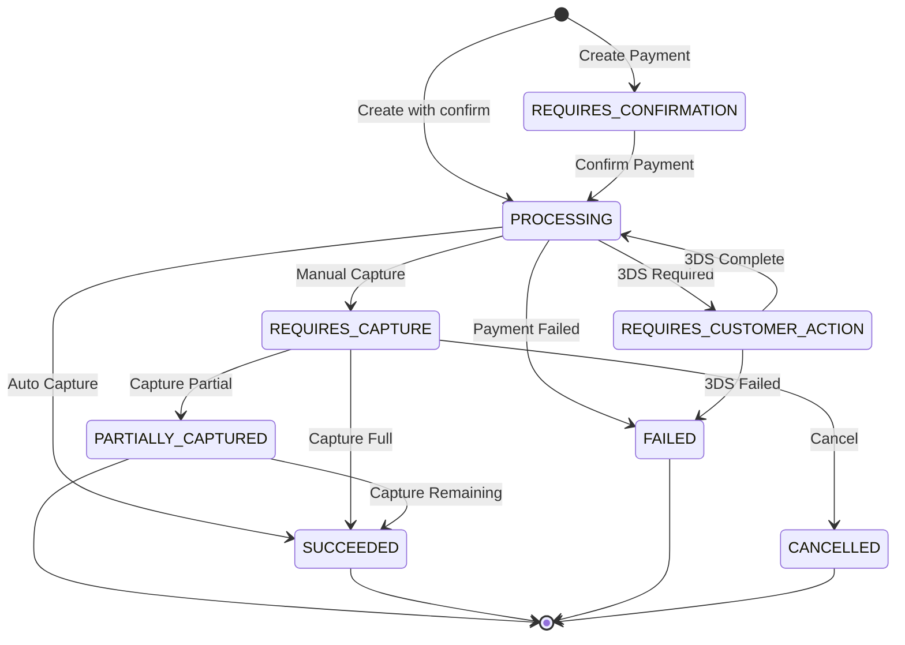
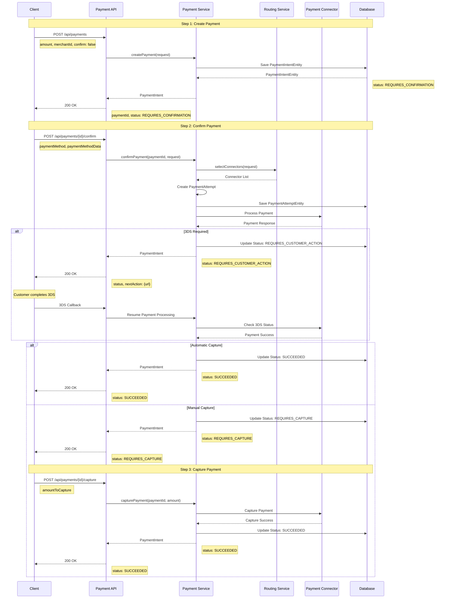
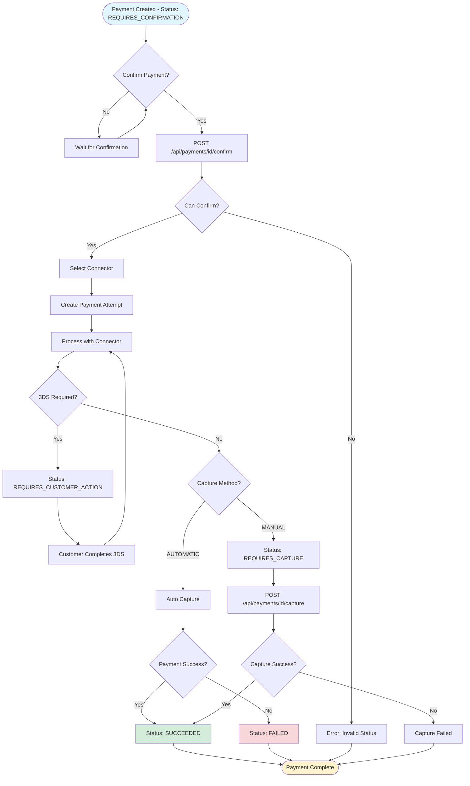
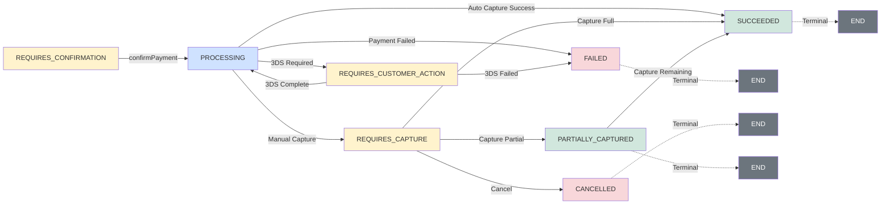
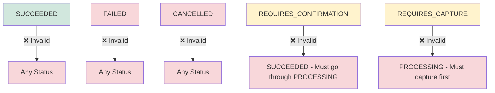
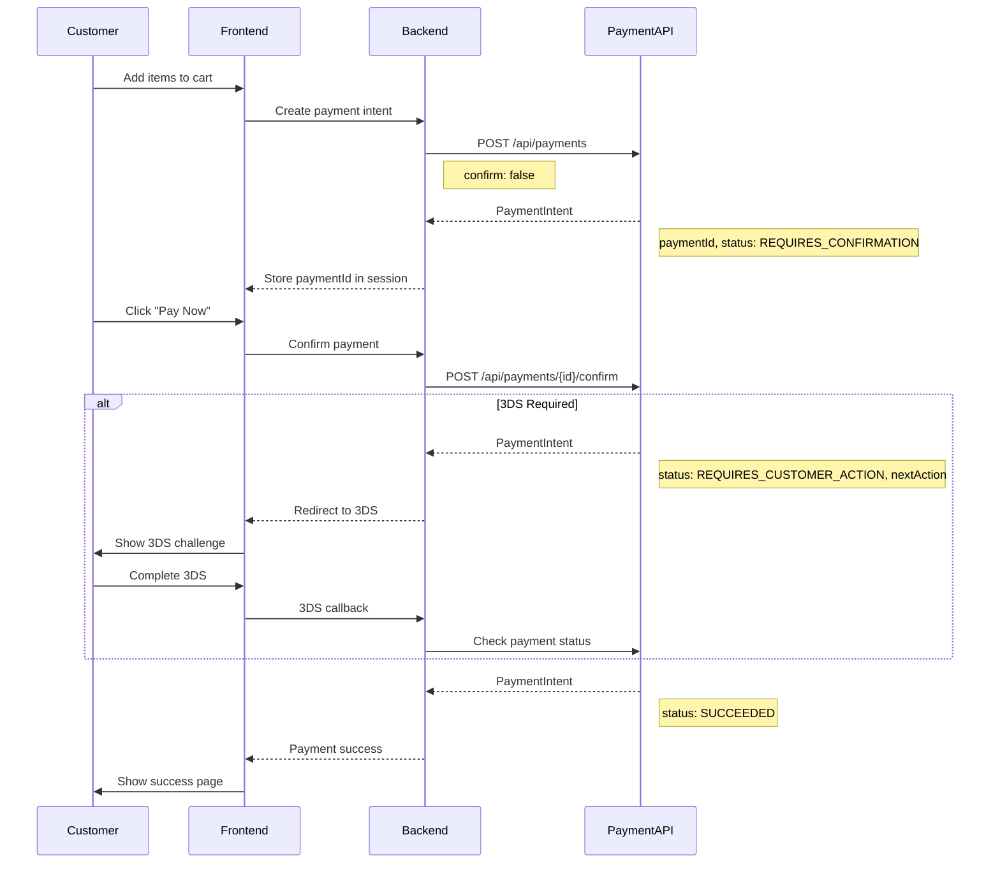
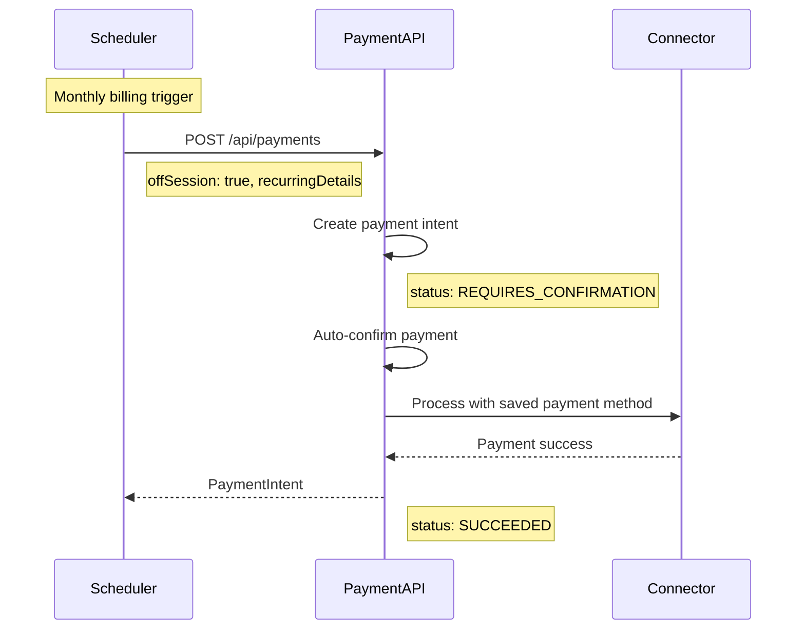
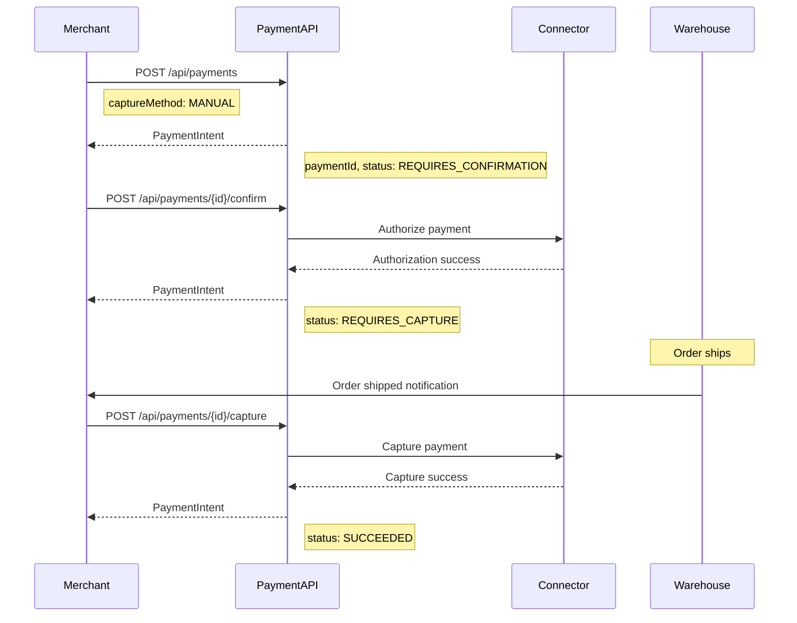
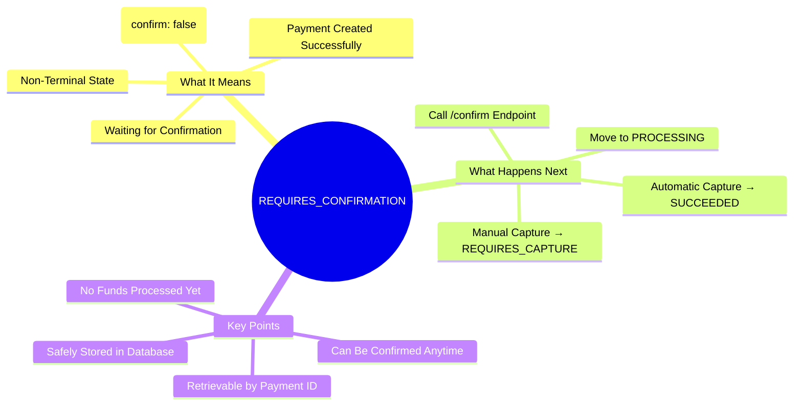
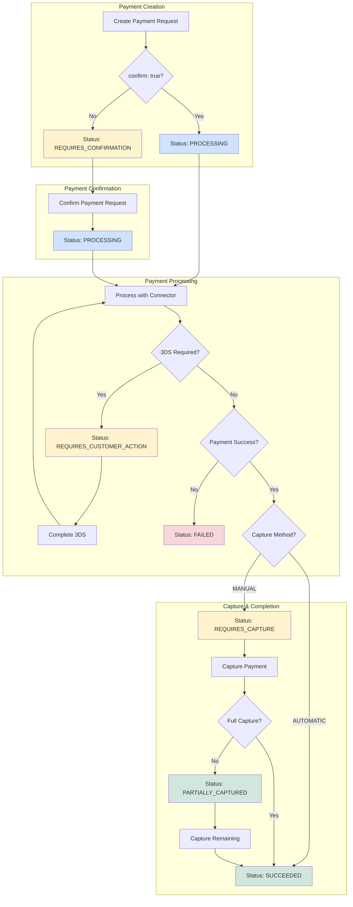

# Payment Flow Documentation

## Table of Contents
1. [Payment Status Overview](#payment-status-overview)
2. [Payment Flow States](#payment-flow-states)
3. [Complete Payment Flow](#complete-payment-flow)
4. [API Endpoints](#api-endpoints)
5. [Testing Guide](#testing-guide)
6. [Status Transitions](#status-transitions)

---

## Payment Status Overview

### What is `REQUIRES_CONFIRMATION`?

`REQUIRES_CONFIRMATION` is the initial status of a payment after creation. It indicates that:
- ✅ Payment intent has been created successfully
- ✅ Payment details (amount, currency, merchant) are stored
- ⏳ Payment is waiting to be confirmed before processing
- ⏳ No payment method has been attached yet (in most cases)

**Key Points:**
- This is a **non-terminal state** - the payment must be confirmed to proceed
- Payments in this state can be confirmed via the `/confirm` endpoint
- If `confirm: false` is set during creation, payment stays in this state
- If `confirm: true` is set during creation, payment automatically moves to `PROCESSING`

---

## Payment Flow States

### Available Payment Statuses

| Status | Description | Terminal? | Next Actions |
|--------|-------------|-----------|--------------|
| `REQUIRES_CONFIRMATION` | Payment created, waiting for confirmation | ❌ | Confirm payment |
| `PROCESSING` | Payment is being processed by connector | ❌ | Wait for result or handle 3DS |
| `REQUIRES_CUSTOMER_ACTION` | 3DS authentication required | ❌ | Complete 3DS challenge |
| `REQUIRES_CAPTURE` | Payment authorized, needs capture | ❌ | Capture payment |
| `PARTIALLY_CAPTURED` | Partial amount captured | ✅ | Capture remaining or complete |
| `SUCCEEDED` | Payment completed successfully | ✅ | None (terminal) |
| `FAILED` | Payment processing failed | ✅ | Retry with new payment |
| `CANCELLED` | Payment was cancelled | ✅ | None (terminal) |

---

## Complete Payment Flow

### Payment Lifecycle State Diagram



### Payment Flow Sequence Diagram



### Payment Confirmation Decision Flow



### Detailed Flow Steps

#### Step 1: Create Payment

**Endpoint:** `POST /api/payments`

**Request:**
```json
{
  "amount": {
    "value": 1000,
    "currencyCode": "USD"
  },
  "merchantId": "merchant_123",
  "customerId": "cust_123",
  "paymentMethod": "CARD",
  "description": "Payment for order #12345",
  "captureMethod": "AUTOMATIC",
  "confirm": false,
  "metadata": {}
}
```

**Response:**
```json
{
  "paymentId": {
    "value": "40c5f9ab-1ee3-4636-9ecc-613fc7de1aa2"
  },
  "amount": {
    "value": 1000,
    "currency": "USD",
    "currencyCode": "USD"
  },
  "status": "REQUIRES_CONFIRMATION",
  "merchantId": "merchant_123",
  "customerId": "cust_123",
  "createdAt": "2026-01-01T08:05:32.387409300Z",
  "updatedAt": "2026-01-01T08:05:32.387409300Z",
  "metadata": {}
}
```

**Key Fields:**
- `confirm: false` - Payment stays in `REQUIRES_CONFIRMATION` (default)
- `confirm: true` - Payment auto-confirms and moves to `PROCESSING`
- `captureMethod: "AUTOMATIC"` - Funds captured immediately after confirmation
- `captureMethod: "MANUAL"` - Requires separate capture call

---

#### Step 2: Confirm Payment

**Endpoint:** `POST /api/payments/{paymentId}/confirm`

**Request:**
```json
{
  "paymentMethod": "CARD",
  "paymentMethodData": {
    "card": {
      "card_number": "4242424242424242",
      "card_exp_month": "12",
      "card_exp_year": "2025",
      "card_holder_name": "John Doe",
      "card_cvc": "123"
    }
  },
  "returnUrl": "https://merchant.com/return",
  "metadata": {}
}
```

**Alternative (using saved payment method):**
```json
{
  "paymentMethod": "CARD",
  "paymentMethodData": {
    "payment_method_id": "pm_123"
  },
  "returnUrl": "https://merchant.com/return"
}
```

**For Merchant-Initiated Transactions (MIT):**
```json
{
  "paymentMethod": "CARD",
  "paymentMethodData": {
    "payment_method_id": "pm_123"
  },
  "offSession": true,
  "recurringDetails": {
    "mandateId": "mandate_123"
  }
}
```

**Response (Success - Automatic Capture):**
```json
{
  "paymentId": {
    "value": "40c5f9ab-1ee3-4636-9ecc-613fc7de1aa2"
  },
  "amount": {
    "value": 1000,
    "currency": "USD",
    "currencyCode": "USD"
  },
  "status": "SUCCEEDED",
  "merchantId": "merchant_123",
  "customerId": "cust_123",
  "connectorName": "stripe",
  "connectorTransactionId": "txn_abc123",
  "createdAt": "2026-01-01T08:05:32.387409300Z",
  "updatedAt": "2026-01-01T08:10:15.123456789Z"
}
```

**Response (3DS Required):**
```json
{
  "paymentId": {
    "value": "40c5f9ab-1ee3-4636-9ecc-613fc7de1aa2"
  },
  "status": "REQUIRES_CUSTOMER_ACTION",
  "nextAction": {
    "type": "redirect_to_url",
    "url": "https://3ds.example.com/challenge?token=xyz"
  }
}
```

**Response (Manual Capture):**
```json
{
  "paymentId": {
    "value": "40c5f9ab-1ee3-4636-9ecc-613fc7de1aa2"
  },
  "status": "REQUIRES_CAPTURE",
  "amount": {
    "value": 1000,
    "currency": "USD"
  }
}
```

---

#### Step 3: Capture Payment (Manual Capture Only)

**Endpoint:** `POST /api/payments/{paymentId}/capture`

**Request:**
```json
{
  "amountToCapture": 1000
}
```

**Response:**
```json
{
  "paymentId": {
    "value": "40c5f9ab-1ee3-4636-9ecc-613fc7de1aa2"
  },
  "status": "SUCCEEDED",
  "amountCaptured": 1000,
  "amount": {
    "value": 1000,
    "currency": "USD"
  }
}
```

---

## API Endpoints

### 1. Create Payment
- **Method:** `POST`
- **Path:** `/api/payments`
- **Headers:**
  - `Content-Type: application/json`
  - `X-Merchant-Id: merchant_123` (optional, can be in body)
- **Body:** `CreatePaymentRequest`
- **Response:** `PaymentIntent` with status `REQUIRES_CONFIRMATION`

### 2. Confirm Payment
- **Method:** `POST`
- **Path:** `/api/payments/{paymentId}/confirm`
- **Headers:**
  - `Content-Type: application/json`
- **Body:** `ConfirmPaymentRequest`
- **Response:** `PaymentIntent` with updated status

### 3. Capture Payment
- **Method:** `POST`
- **Path:** `/api/payments/{paymentId}/capture`
- **Headers:**
  - `Content-Type: application/json`
- **Body:** `CapturePaymentRequest`
- **Response:** `PaymentIntent` with status `SUCCEEDED` or `PARTIALLY_CAPTURED`

### 4. Get Payment Status
- **Method:** `GET`
- **Path:** `/api/payments/{paymentId}`
- **Response:** `PaymentIntent` with current status

---

## Testing Guide

### Test Scenario 1: Complete Flow with Automatic Capture

#### Step 1: Create Payment
```bash
curl -X POST http://localhost:8080/api/payments \
  -H "Content-Type: application/json" \
  -H "X-Merchant-Id: merchant_123" \
  -d '{
    "amount": {
      "value": 1000,
      "currencyCode": "USD"
    },
    "merchantId": "merchant_123",
    "customerId": "cust_123",
    "paymentMethod": "CARD",
    "description": "Test payment",
    "captureMethod": "AUTOMATIC",
    "confirm": false,
    "metadata": {}
  }'
```

**Expected Response:**
- Status: `REQUIRES_CONFIRMATION`
- Payment ID generated
- Save the `paymentId` for next step

#### Step 2: Confirm Payment
```bash
curl -X POST http://localhost:8080/api/payments/{paymentId}/confirm \
  -H "Content-Type: application/json" \
  -d '{
    "paymentMethod": "CARD",
    "paymentMethodData": {
      "card": {
        "card_number": "4242424242424242",
        "card_exp_month": "12",
        "card_exp_year": "2025",
        "card_holder_name": "John Doe",
        "card_cvc": "123"
      }
    },
    "returnUrl": "https://merchant.com/return",
    "metadata": {}
  }'
```

**Note:** Replace `{paymentId}` with the actual payment ID from Step 1.

**Expected Response:**
- Status: `SUCCEEDED` (if automatic capture)
- Status: `PROCESSING` (if still processing)
- Status: `REQUIRES_CUSTOMER_ACTION` (if 3DS required)

#### Step 3: Verify Payment Status
```bash
curl -X GET http://localhost:8080/api/payments/{paymentId}
```

**Expected Response:**
- Status: `SUCCEEDED`
- `connectorTransactionId` present
- `amountCaptured` equals `amount`

---

### Test Scenario 2: Complete Flow with Manual Capture

#### Step 1: Create Payment
```bash
curl -X POST http://localhost:8080/api/payments \
  -H "Content-Type: application/json" \
  -H "X-Merchant-Id: merchant_123" \
  -d '{
    "amount": {
      "value": 1000,
      "currencyCode": "USD"
    },
    "merchantId": "merchant_123",
    "customerId": "cust_123",
    "paymentMethod": "CARD",
    "description": "Test payment - manual capture",
    "captureMethod": "MANUAL",
    "confirm": false,
    "metadata": {}
  }'
```

#### Step 2: Confirm Payment
```bash
curl -X POST http://localhost:8080/api/payments/{paymentId}/confirm \
  -H "Content-Type: application/json" \
  -d '{
    "paymentMethod": "CARD",
    "paymentMethodData": {
      "card": {
        "card_number": "4242424242424242",
        "card_exp_month": "12",
        "card_exp_year": "2025",
        "card_holder_name": "John Doe",
        "card_cvc": "123"
      }
    },
    "returnUrl": "https://merchant.com/return"
  }'
```

**Note:** The `captureMethod` is set during payment creation, not confirmation.

**Expected Response:**
- Status: `REQUIRES_CAPTURE`

#### Step 3: Capture Payment
```bash
curl -X POST http://localhost:8080/api/payments/{paymentId}/capture \
  -H "Content-Type: application/json" \
  -d '{
    "amountToCapture": 1000
  }'
```

**Expected Response:**
- Status: `SUCCEEDED`
- `amountCaptured: 1000`

---

### Test Scenario 3: Create and Confirm in One Step

#### Single Request
```bash
curl -X POST http://localhost:8080/api/payments \
  -H "Content-Type: application/json" \
  -H "X-Merchant-Id: merchant_123" \
  -d '{
    "amount": {
      "value": 1000,
      "currencyCode": "USD"
    },
    "merchantId": "merchant_123",
    "customerId": "cust_123",
    "paymentMethod": "CARD",
    "description": "Test payment - auto confirm",
    "captureMethod": "AUTOMATIC",
    "confirm": true,
    "metadata": {}
  }'
```

**Expected Response:**
- Status: `PROCESSING` or `SUCCEEDED` (depending on connector response)
- Payment automatically confirmed

---

### Test Scenario 4: Postman Collection

#### Collection Structure
```
Payment Service API
├── 1. Create Payment
│   ├── Method: POST
│   ├── URL: {{baseUrl}}/api/payments
│   ├── Headers:
│   │   - Content-Type: application/json
│   │   - X-Merchant-Id: merchant_123
│   └── Body: (see Create Payment request above)
│
├── 2. Confirm Payment
│   ├── Method: POST
│   ├── URL: {{baseUrl}}/api/payments/{{paymentId}}/confirm
│   ├── Headers:
│   │   - Content-Type: application/json
│   └── Body: (see Confirm Payment request above)
│
├── 3. Capture Payment (Manual)
│   ├── Method: POST
│   ├── URL: {{baseUrl}}/api/payments/{{paymentId}}/capture
│   ├── Headers:
│   │   - Content-Type: application/json
│   └── Body: {"amountToCapture": 1000}
│
└── 4. Get Payment Status
    ├── Method: GET
    └── URL: {{baseUrl}}/api/payments/{{paymentId}}
```

#### Postman Environment Variables
```json
{
  "baseUrl": "http://localhost:8080",
  "merchantId": "merchant_123",
  "customerId": "cust_123",
  "paymentId": ""
}
```

#### Postman Test Scripts

**For Create Payment:**
```javascript
// Save paymentId for next requests
if (pm.response.code === 200) {
    const response = pm.response.json();
    pm.environment.set("paymentId", response.paymentId.value);
    pm.test("Status is REQUIRES_CONFIRMATION", function () {
        pm.expect(response.status).to.eql("REQUIRES_CONFIRMATION");
    });
}
```

**For Confirm Payment:**
```javascript
if (pm.response.code === 200) {
    const response = pm.response.json();
    pm.test("Status is not REQUIRES_CONFIRMATION", function () {
        pm.expect(response.status).to.not.eql("REQUIRES_CONFIRMATION");
    });
    pm.test("Status is valid", function () {
        const validStatuses = [
            "PROCESSING",
            "SUCCEEDED",
            "REQUIRES_CUSTOMER_ACTION",
            "REQUIRES_CAPTURE"
        ];
        pm.expect(validStatuses).to.include(response.status);
    });
}
```

---

## Status Transitions

### Valid Status Transitions Diagram



### Status Transition Table

| From Status | Action | To Status | Notes |
|------------|--------|-----------|-------|
| `REQUIRES_CONFIRMATION` | `confirmPayment()` | `PROCESSING` | Default confirmation flow |
| `PROCESSING` | Connector success + Auto capture | `SUCCEEDED` | Automatic capture mode |
| `PROCESSING` | Connector success + Manual capture | `REQUIRES_CAPTURE` | Manual capture mode |
| `PROCESSING` | 3DS required | `REQUIRES_CUSTOMER_ACTION` | 3DS authentication needed |
| `PROCESSING` | Connector failure | `FAILED` | Payment processing failed |
| `REQUIRES_CUSTOMER_ACTION` | 3DS complete | `PROCESSING` | Resume processing |
| `REQUIRES_CUSTOMER_ACTION` | 3DS failed | `FAILED` | Authentication failed |
| `REQUIRES_CAPTURE` | Capture full amount | `SUCCEEDED` | Full capture |
| `REQUIRES_CAPTURE` | Capture partial amount | `PARTIALLY_CAPTURED` | Partial capture |
| `REQUIRES_CAPTURE` | Cancel payment | `CANCELLED` | Payment cancelled |
| `PARTIALLY_CAPTURED` | Capture remaining | `SUCCEEDED` | Complete capture |

### Invalid Transitions



**Invalid Transition Rules:**
- ❌ `SUCCEEDED` → Any other status (terminal state)
- ❌ `FAILED` → Any other status (terminal state)
- ❌ `CANCELLED` → Any other status (terminal state)
- ❌ `REQUIRES_CONFIRMATION` → `SUCCEEDED` (must go through PROCESSING)
- ❌ `REQUIRES_CAPTURE` → `PROCESSING` (must capture first)

---

## Common Use Cases

### Use Case 1: E-commerce Checkout



**Steps:**
1. **Create Payment** when customer adds items to cart
   - Status: `REQUIRES_CONFIRMATION`
   - Store `paymentId` in session

2. **Confirm Payment** when customer clicks "Pay Now"
   - Status: `PROCESSING` → `SUCCEEDED`
   - Redirect to success page

3. **Handle 3DS** if required
   - Status: `REQUIRES_CUSTOMER_ACTION`
   - Redirect to 3DS challenge
   - Return to merchant after completion

### Use Case 2: Subscription Billing



**Steps:**
1. **Create Payment** with `offSession: true`
   - Status: `REQUIRES_CONFIRMATION`

2. **Confirm Payment** with saved payment method
   - Status: `SUCCEEDED` (automatic capture)
   - No customer interaction needed

### Use Case 3: Authorize and Capture Later



**Steps:**
1. **Create Payment** with `captureMethod: "MANUAL"`
   - Status: `REQUIRES_CONFIRMATION`

2. **Confirm Payment**
   - Status: `REQUIRES_CAPTURE`

3. **Capture Payment** when order ships
   - Status: `SUCCEEDED`

---

## Error Handling

### Common Errors

#### 1. Payment Not Found
```json
{
  "error": {
    "message": "Payment not found",
    "code": "PAYMENT_NOT_FOUND"
  }
}
```
**Solution:** Verify `paymentId` is correct

#### 2. Invalid Status for Confirmation
```json
{
  "error": {
    "message": "Payment cannot be confirmed in current status: SUCCEEDED",
    "code": "INVALID_STATUS"
  }
}
```
**Solution:** Only payments in `REQUIRES_CONFIRMATION` or `REQUIRES_CUSTOMER_ACTION` can be confirmed

#### 3. No Connector Available
```json
{
  "error": {
    "message": "No suitable connector found for payment",
    "code": "NO_CONNECTOR_AVAILABLE"
  }
}
```
**Solution:** Check connector configuration and payment method support

---

## Best Practices

1. **Always check payment status** before taking action
2. **Handle 3DS redirects** properly in your frontend
3. **Use webhooks** for async status updates (if implemented)
4. **Store paymentId** securely in your session/database
5. **Implement retry logic** for transient failures
6. **Log all status transitions** for debugging
7. **Use idempotency keys** for critical operations (if supported)

---

## Troubleshooting

### Payment Stuck in REQUIRES_CONFIRMATION

**Possible Causes:**
- Payment was created with `confirm: false` and never confirmed
- Confirmation endpoint was not called
- Confirmation request failed

**Solution:**
- Call `/api/payments/{paymentId}/confirm` endpoint
- Check logs for confirmation errors

### Payment Stuck in PROCESSING

**Possible Causes:**
- Connector is slow to respond
- Webhook not received (if using webhooks)
- Network issues

**Solution:**
- Poll `/api/payments/{paymentId}` to check status
- Check connector logs
- Implement timeout handling

### Payment Failed After Confirmation

**Possible Causes:**
- Insufficient funds
- Card declined
- Invalid payment method
- Connector error

**Solution:**
- Check error message in response
- Verify payment method details
- Retry with different payment method

---

## Additional Resources

- **API Documentation:** Swagger UI at `http://localhost:8080/swagger-ui.html`
- **Payment Status Enum:** `PaymentStatus.java`
- **Service Implementation:** `PaymentServiceImpl.java`
- **Controller:** `PaymentController.java`

---

## Quick Reference

### Status Meanings
- `REQUIRES_CONFIRMATION` = Payment created, waiting for confirmation
- `PROCESSING` = Payment being processed by connector
- `REQUIRES_CUSTOMER_ACTION` = 3DS authentication needed
- `REQUIRES_CAPTURE` = Authorized, needs capture
- `SUCCEEDED` = Payment completed successfully
- `FAILED` = Payment failed
- `CANCELLED` = Payment cancelled

### Key Endpoints
- `POST /api/payments` - Create payment
- `POST /api/payments/{id}/confirm` - Confirm payment
- `POST /api/payments/{id}/capture` - Capture payment
- `GET /api/payments/{id}` - Get payment status

---

---

## Request/Response Examples

### Complete Example: Create → Confirm → Check Status

#### 1. Create Payment Request
```bash
POST http://localhost:8080/api/payments
Content-Type: application/json
X-Merchant-Id: merchant_123

{
  "amount": {
    "value": 1000,
    "currencyCode": "USD"
  },
  "merchantId": "merchant_123",
  "customerId": "cust_123",
  "paymentMethod": "CARD",
  "description": "Test payment",
  "captureMethod": "AUTOMATIC",
  "confirm": false,
  "metadata": {}
}
```

#### 2. Create Payment Response
```json
{
  "paymentId": {
    "value": "40c5f9ab-1ee3-4636-9ecc-613fc7de1aa2"
  },
  "amount": {
    "value": 1000,
    "currency": "USD",
    "currencyCode": "USD"
  },
  "status": "REQUIRES_CONFIRMATION",
  "merchantId": "merchant_123",
  "customerId": "cust_123",
  "createdAt": "2026-01-01T08:05:32.387409300Z",
  "updatedAt": "2026-01-01T08:05:32.387409300Z",
  "metadata": {}
}
```

#### 3. Confirm Payment Request
```bash
POST http://localhost:8080/api/payments/40c5f9ab-1ee3-4636-9ecc-613fc7de1aa2/confirm
Content-Type: application/json

{
  "paymentMethod": "CARD",
  "paymentMethodData": {
    "card": {
      "card_number": "4242424242424242",
      "card_exp_month": "12",
      "card_exp_year": "2025",
      "card_holder_name": "John Doe",
      "card_cvc": "123"
    }
  },
  "returnUrl": "https://merchant.com/return"
}
```

#### 4. Confirm Payment Response (Success)
```json
{
  "paymentId": {
    "value": "40c5f9ab-1ee3-4636-9ecc-613fc7de1aa2"
  },
  "amount": {
    "value": 1000,
    "currency": "USD",
    "currencyCode": "USD"
  },
  "status": "SUCCEEDED",
  "merchantId": "merchant_123",
  "customerId": "cust_123",
  "connectorName": "stripe",
  "connectorTransactionId": "txn_abc123",
  "createdAt": "2026-01-01T08:05:32.387409300Z",
  "updatedAt": "2026-01-01T08:10:15.123456789Z"
}
```

#### 5. Get Payment Status Request
```bash
GET http://localhost:8080/api/payments/40c5f9ab-1ee3-4636-9ecc-613fc7de1aa2
```

#### 6. Get Payment Status Response
```json
{
  "paymentId": {
    "value": "40c5f9ab-1ee3-4636-9ecc-613fc7de1aa2"
  },
  "amount": {
    "value": 1000,
    "currency": "USD",
    "currencyCode": "USD"
  },
  "status": "SUCCEEDED",
  "merchantId": "merchant_123",
  "customerId": "cust_123",
  "connectorName": "stripe",
  "connectorTransactionId": "txn_abc123",
  "createdAt": "2026-01-01T08:05:32.387409300Z",
  "updatedAt": "2026-01-01T08:10:15.123456789Z"
}
```

---

---

## Postman Collection Setup

### Environment Variables

Create a Postman environment with these variables:

```json
{
  "baseUrl": "http://localhost:8080",
  "merchantId": "merchant_123",
  "customerId": "cust_123",
  "paymentId": "",
  "connectorTransactionId": ""
}
```

### Collection Structure

1. **Create Payment**
   - Method: `POST`
   - URL: `{{baseUrl}}/api/payments`
   - Headers:
     - `Content-Type: application/json`
     - `X-Merchant-Id: {{merchantId}}`
   - Body:
     ```json
     {
       "amount": {
         "value": 1000,
         "currencyCode": "USD"
       },
       "merchantId": "{{merchantId}}",
       "customerId": "{{customerId}}",
       "paymentMethod": "CARD",
       "description": "Test payment",
       "captureMethod": "AUTOMATIC",
       "confirm": false,
       "metadata": {}
     }
     ```
   - Tests:
     ```javascript
     if (pm.response.code === 200) {
         const response = pm.response.json();
         pm.environment.set("paymentId", response.paymentId.value);
         pm.test("Status is REQUIRES_CONFIRMATION", function () {
             pm.expect(response.status).to.eql("REQUIRES_CONFIRMATION");
         });
     }
     ```

2. **Confirm Payment**
   - Method: `POST`
   - URL: `{{baseUrl}}/api/payments/{{paymentId}}/confirm`
   - Headers:
     - `Content-Type: application/json`
   - Body:
     ```json
     {
       "paymentMethod": "CARD",
       "paymentMethodData": {
         "card": {
           "card_number": "4242424242424242",
           "card_exp_month": "12",
           "card_exp_year": "2025",
           "card_holder_name": "John Doe",
           "card_cvc": "123"
         }
       },
       "returnUrl": "https://merchant.com/return"
     }
     ```
   - Tests:
     ```javascript
     if (pm.response.code === 200) {
         const response = pm.response.json();
         pm.test("Status changed from REQUIRES_CONFIRMATION", function () {
             pm.expect(response.status).to.not.eql("REQUIRES_CONFIRMATION");
         });
         if (response.connectorTransactionId) {
             pm.environment.set("connectorTransactionId", response.connectorTransactionId);
         }
     }
     ```

3. **Get Payment Status**
   - Method: `GET`
   - URL: `{{baseUrl}}/api/payments/{{paymentId}}`
   - Tests:
     ```javascript
     pm.test("Status code is 200", function () {
         pm.response.to.have.status(200);
     });
     const response = pm.response.json();
     pm.test("Payment ID matches", function () {
         pm.expect(response.paymentId.value).to.eql(pm.environment.get("paymentId"));
     });
     ```

4. **Capture Payment (Manual)**
   - Method: `POST`
   - URL: `{{baseUrl}}/api/payments/{{paymentId}}/capture`
   - Headers:
     - `Content-Type: application/json`
   - Body:
     ```json
     {
       "amountToCapture": 1000
     }
     ```

---

## Summary

### Payment Status: REQUIRES_CONFIRMATION



**What it means:**
- Payment intent has been created successfully
- Payment is waiting for confirmation before processing
- This is the default status when `confirm: false` is set during creation

**What happens next:**
1. Call `/api/payments/{paymentId}/confirm` to initiate processing
2. Payment moves to `PROCESSING` status
3. Based on capture method:
   - `AUTOMATIC` → Moves to `SUCCEEDED` after connector success
   - `MANUAL` → Moves to `REQUIRES_CAPTURE` after authorization

**Key Points:**
- ✅ Payment is safely stored in database
- ✅ Can be confirmed at any time (until cancelled)
- ✅ Can be retrieved using payment ID
- ⏳ No funds are processed until confirmation

### Complete Flow Overview



---

**Last Updated:** 2026-01-01  
**Version:** 1.0.0

